# MEAN STACK IMPLEMENTATION

**MEAN stack** is a combination of the following:

- **MongoDB** (Document database) – Stores and allows to retrieve data.
- **Express** (Back-end application framework) – Makes requests to Database for Reads and Writes.
- **Angular** (Front-end application framework) – Handles Client and server Requests.
- **Node.js** (JavaScript runtime environment) – Accepts requests and displays results to end user.
To complete this project you will need an AWS account and an instance with **Ubuntu Server OS**. We are setting up a **MEAN STACK** using **EC2**.


We need to do the following:

create an account on [AWS](https://aws.amazon.com/).
we create an instance (virtual machine) by selecting “`ubuntu server 20.04 LTS`” from `Amazon Machine Image(AMI)`(free tier).
we select **“t2.micro(free tier eligible)”**.
then go to the security group and select `a security group` review and launch.
How to create an aws free tier account. click [here](https://www.youtube.com/watch?v=xxKuB9kJoYM&list=PLtPuNR8I4TvkwU7Zu0l0G_uwtSUXLckvh&index=8)

This launches us into the instance as shown in the screenshot:

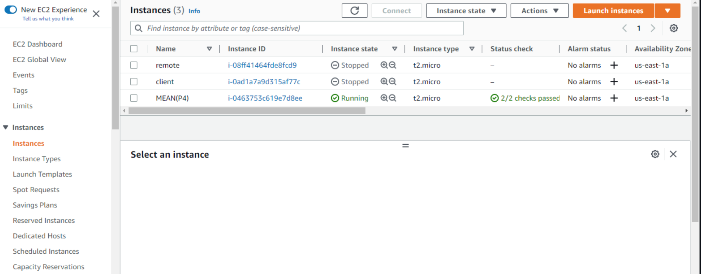

We open our terminal and go to the location of the previously downloaded PEM file.

To know how to download PEM File from AWS. Click [HERE](https://intellipaat.com/community/52119/how-to-download-a-pem-file-from-aws).

We connect to the instance from our terminal

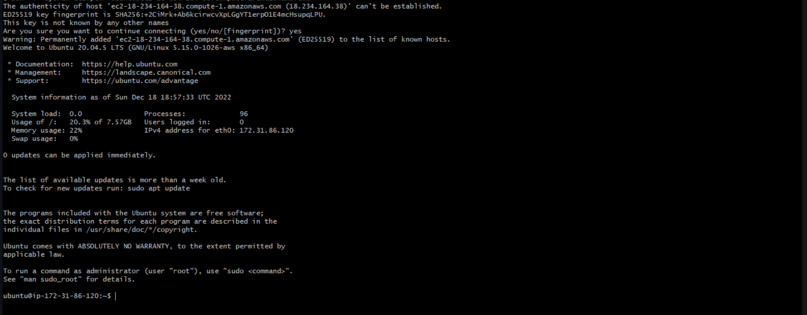

**TASK**

In this task, we are going to implement a simple Book Register web form using MEAN stack.

There are a few steps we need to take to accomplish this task. These steps include:

**INSTALLING NODEJS**

`Node.js` is a JavaScript runtime built on Chrome’s V8 JavaScript engine. Node.js is used in this task to set up the `Express routes` and `AngularJS controllers`.

update ubuntu
```
sudo apt update
```
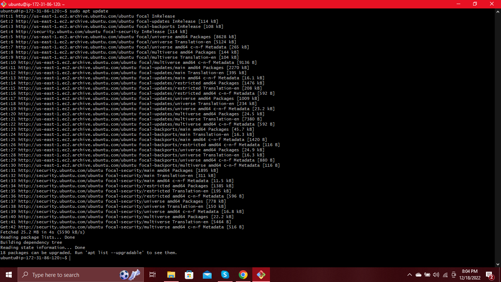

Next we upgrade ubuntu.
```
sudo apt upgrade
```

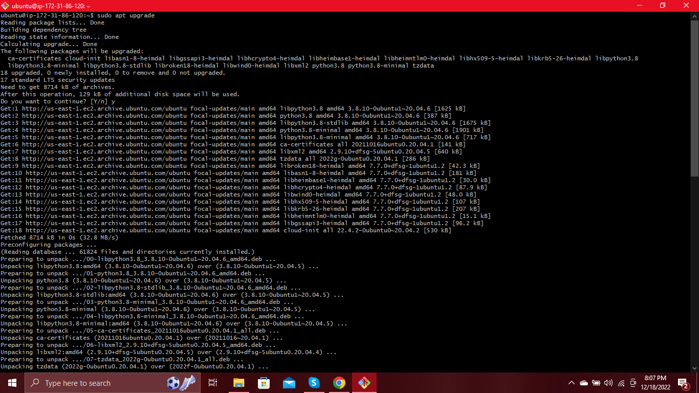

we add certificates by running these commands:
```
sudo apt -y install curl dirmngr apt-transport-https lsb-release ca-certificates
```
then
```
curl -sL https://deb.nodesource.com/setup_12.x | sudo -E bash -
```

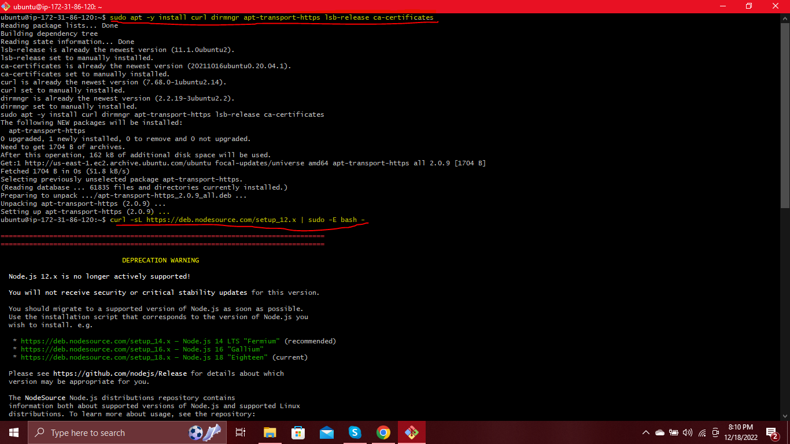

Then we install node.js
```
sudo apt install -y nodejs
```

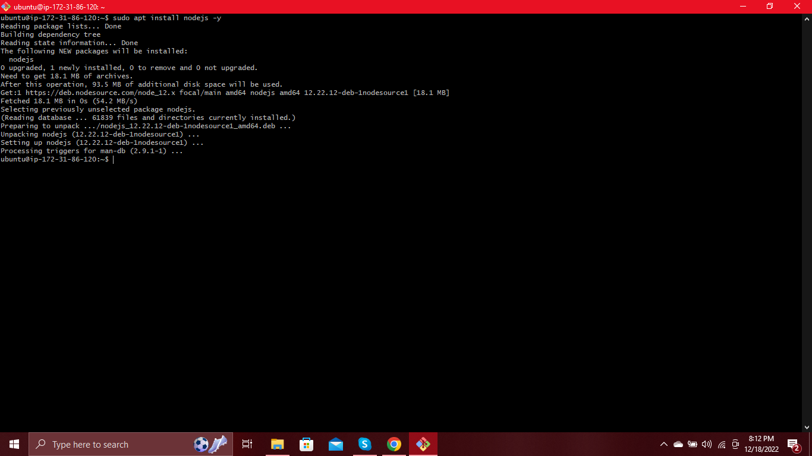

Then next step is to install MongoDB.

**INSTALLING MONGODB**

`MongoDB` stores data in flexible, `JSON`-like documents. Fields in a database can vary from document to document and data structure can be changed over time. For our example application, we are adding book records to `MongoDB` that contain book name, isbn number, author, and number of pages.

To start installation process, we run the commands:
```
sudo apt-key adv --keyserver hkp://keyserver.ubuntu.com:80 --recv 0C49F3730359A14518585931BC711F9BA15703C6
```
then
```
echo "deb [ arch=amd64 ] https://repo.mongodb.org/apt/ubuntu trusty/mongodb-org/3.4 multiverse" | sudo tee /etc/apt/sources.list.d/mongodb-org-3.4.list
```


We then go ahead to install `mongoDB` by running the command:
```
sudo apt install -y mongodb
```
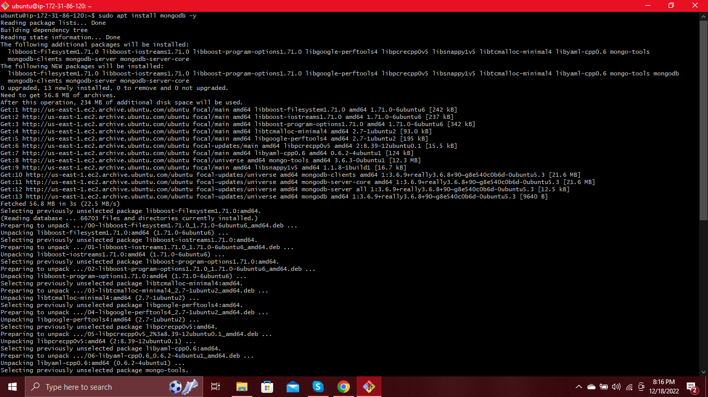

Next, we start the MongoDB_ server.
```
sudo systemctl start mongodb
```
To verify that the server is up and running, we run the command:
```
sudo systemctl status momgodb
```


We then install Node package manager (npm).
```
sudo apt install -y npm
```
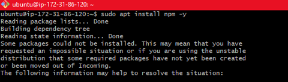

We then Install body-parser package-We need ‘body-parser’ package to help us process JSON files passed in requests to the server.
```
sudo npm install body-parser
```
We create a folder named "Books" and "cd" into the folder using this command:
```
mkdir Books && cd Books
```
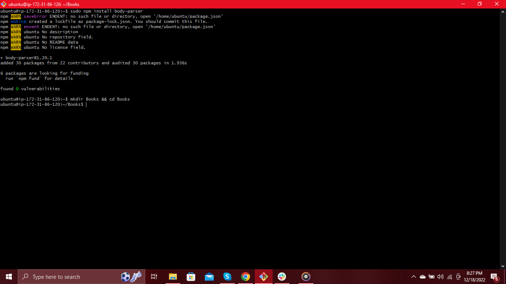

We then run the command to initialisze `npm project`.
```
npm init
```
Add a file to it named server.js.
```
touch server.js
```
Open the file
```
vim server.js
```
Then copy the following codes into the server.js file.

```
var express = require('express');
var bodyParser = require('body-parser');
var app = express();
app.use(express.static(__dirname + '/public'));
app.use(bodyParser.json());
require('./apps/routes')(app);
app.set('port', 3300);
app.listen(app.get('port'), function() {
    console.log('Server up: http://localhost:' + app.get('port'));
});
```
Then save and quit press ESC, then :wq and ENTER.

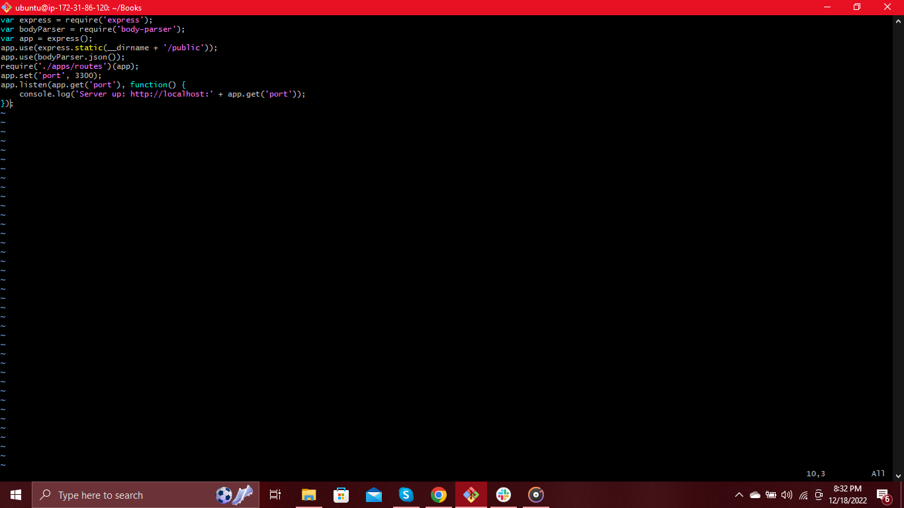

The next thing to do is to install `Express` and set up `Routes` to the server.

**INSTALLING EXPRESS AND SETTING UP ROUTES TO THE SERVER**

`Express` is a minimal and flexible `Node.js web application framework` that provides features for web and mobile applications. We will use `Express` to pass book information to and from our `MongoDB database`.

We also will use `Mongoose` package which provides a straight-forward, `schema-based` solution to model your application data. We will use `Mongoose` to establish a `schema` for the `database` to store data of our book register.

Install Express and Mongoose.
```
sudo npm install express mongoose
```


In ‘Books’ folder, create a folder named apps
```
mkdir apps && cd apps
```


In Books directory, create a file named routes.js.
```
touch routes.js
```
Open the file
```
vim routes.js
```
Copy the following codes into the file
```
var Book = require('./models/book');
module.exports = function(app) {
  app.get('/book', function(req, res) {
    Book.find({}, function(err, result) {
      if ( err ) throw err;
      res.json(result);
    });
  }); 
  app.post('/book', function(req, res) {
    var book = new Book( {
      name:req.body.name,
      isbn:req.body.isbn,
      author:req.body.author,
      pages:req.body.pages
    });
    book.save(function(err, result) {
      if ( err ) throw err;
      res.json( {
        message:"Successfully added book",
        book:result
      });
    });
  });
  app.delete("/book/:isbn", function(req, res) {
    Book.findOneAndRemove(req.query, function(err, result) {
      if ( err ) throw err;
      res.json( {
        message: "Successfully deleted the book",
        book: result
      });
    });
  });
  var path = require('path');
  app.get('*', function(req, res) {
    res.sendfile(path.join(__dirname + '/public', 'index.html'));
  });
};
```
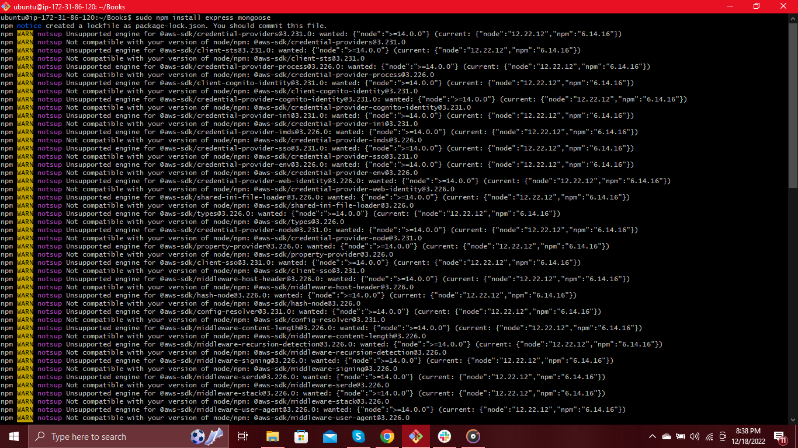

In ‘Books’ folder, create a folder named apps
```
mkdir apps && cd apps
```
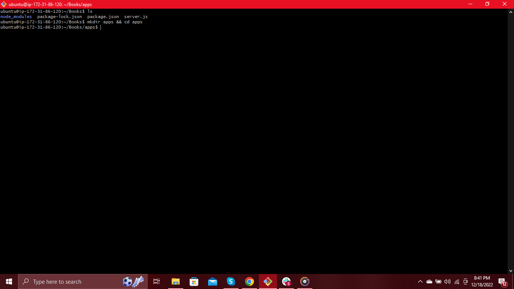

In Books directory, create a file named routes.js.
```
touch routes.js
```
Open the file
```
vi routes.js
```
Copy the following codes into the file
```
var Book = require('./models/book');
module.exports = function(app) {
  app.get('/book', function(req, res) {
    Book.find({}, function(err, result) {
      if ( err ) throw err;
      res.json(result);
    });
  }); 
  app.post('/book', function(req, res) {
    var book = new Book( {
      name:req.body.name,
      isbn:req.body.isbn,
      author:req.body.author,
      pages:req.body.pages
    });
    book.save(function(err, result) {
      if ( err ) throw err;
      res.json( {
        message:"Successfully added book",
        book:result
      });
    });
  });
  app.delete("/book/:isbn", function(req, res) {
    Book.findOneAndRemove(req.query, function(err, result) {
      if ( err ) throw err;
      res.json( {
        message: "Successfully deleted the book",
        book: result
      });
    });
  });
  var path = require('path');
  app.get('*', function(req, res) {
    res.sendfile(path.join(__dirname + '/public', 'index.html'));
  });
};
```

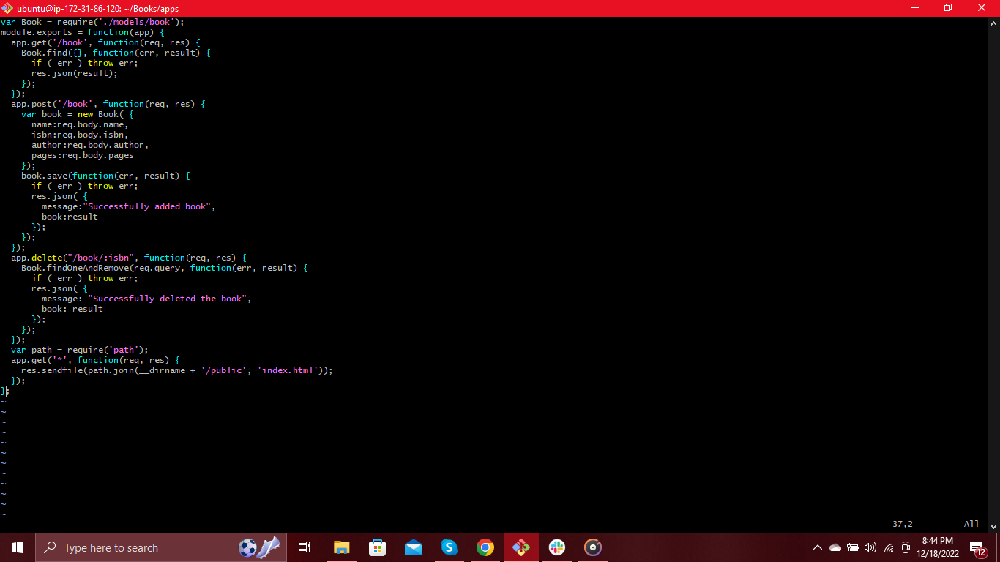

Then save and quit press ESC, then :wq and ENTER.

still in the apps folder, create a folder named models and cd into the folder.
```
mkdir models && cd models
```
Create a file named book.js
```
touch book.js
```
Open the file
```
vi book.js
```
Then we copy and paste the following codes into the file.
```
var mongoose = require('mongoose');
var dbHost = 'mongodb://localhost:27017/test';
mongoose.connect(dbHost);
mongoose.connection;
mongoose.set('debug', true);
var bookSchema = mongoose.Schema( {
  name: String,
  isbn: {type: String, index: true},
  author: String,
  pages: Number
});
var Book = mongoose.model('Book', bookSchema);
module.exports = mongoose.model('Book', bookSchema);
```
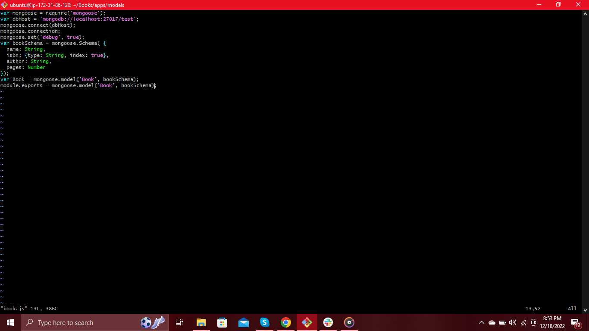

Next step is to access the routes with **AngularJS**.

**ACCESSING THE ROUTE WITH ANGULARJS**

`AngularJS` provides a web framework for creating dynamic views in your web applications. In this task, we use `AngularJS` to connect our web page with Express and perform actions on our book register.

We first change directory back to Books
```
cd../..
```
We create a folder named public and cd into the folder.
```
mkdir public && cd public
```
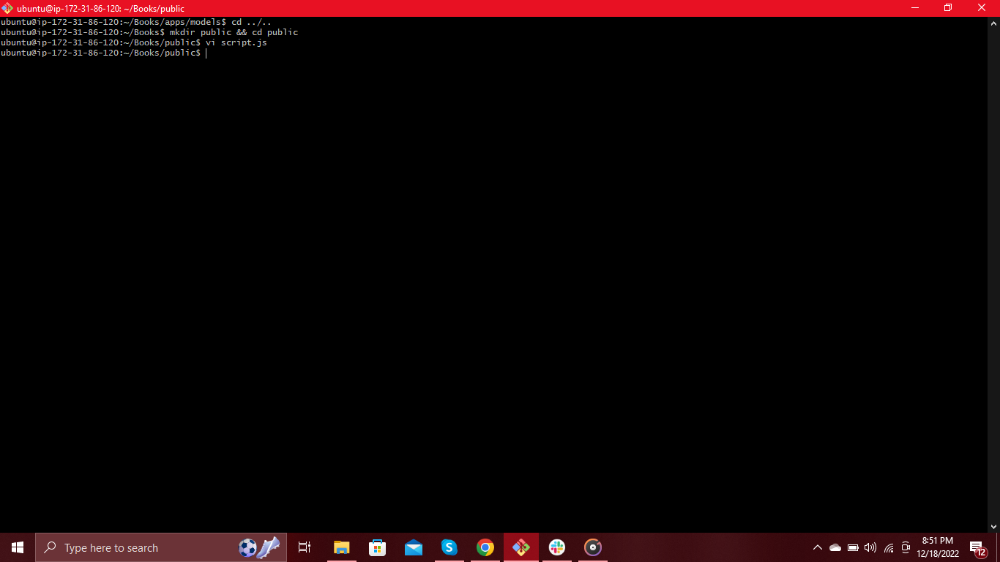

Create a file named scripts.js
```
touch scripts.js
```
Open the file
```
vi scripts.js
```
Copy and paste the following into the file. This is the defined controller configuration.
```
var app = angular.module('myApp', []);
app.controller('myCtrl', function($scope, $http) {
  $http( {
    method: 'GET',
    url: '/book'
  }).then(function successCallback(response) {
    $scope.books = response.data;
  }, function errorCallback(response) {
    console.log('Error: ' + response);
  });
  $scope.del_book = function(book) {
    $http( {
      method: 'DELETE',
      url: '/book/:isbn',
      params: {'isbn': book.isbn}
    }).then(function successCallback(response) {
      console.log(response);
    }, function errorCallback(response) {
      console.log('Error: ' + response);
    });
  };
  $scope.add_book = function() {
    var body = '{ "name": "' + $scope.Name + 
    '", "isbn": "' + $scope.Isbn +
    '", "author": "' + $scope.Author + 
    '", "pages": "' + $scope.Pages + '" }';
    $http({
      method: 'POST',
      url: '/book',
      data: body
    }).then(function successCallback(response) {
      console.log(response);
    }, function errorCallback(response) {
      console.log('Error: ' + response);
    });
  };
});
```
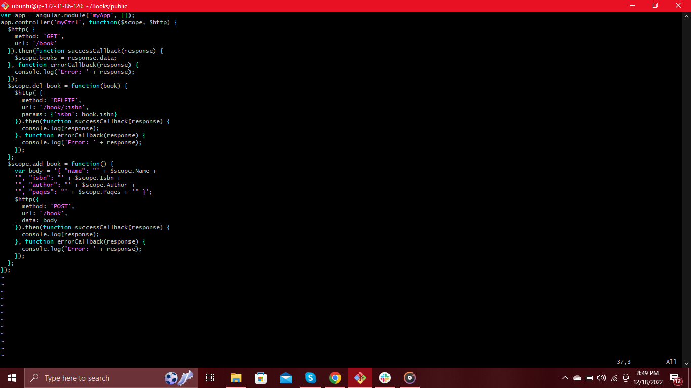

In public folder, create a file named index.html
```
touch index.html
```
Open the file
```
vim index.html
```
Copy and paste the following codes into the file.
```
<!doctype html>
<html ng-app="myApp" ng-controller="myCtrl">
  <head>
    <script src="https://ajax.googleapis.com/ajax/libs/angularjs/1.6.4/angular.min.js"></script>
    <script src="script.js"></script>
  </head>
  <body>
    <div>
      <table>
        <tr>
          <td>Name:</td>
          <td><input type="text" ng-model="Name"></td>
        </tr>
        <tr>
          <td>Isbn:</td>
          <td><input type="text" ng-model="Isbn"></td>
        </tr>
        <tr>
          <td>Author:</td>
          <td><input type="text" ng-model="Author"></td>
        </tr>
        <tr>
          <td>Pages:</td>
          <td><input type="number" ng-model="Pages"></td>
        </tr>
      </table>
      <button ng-click="add_book()">Add</button>
    </div>
    <hr>
    <div>
      <table>
        <tr>
          <th>Name</th>
          <th>Isbn</th>
          <th>Author</th>
          <th>Pages</th>

        </tr>
        <tr ng-repeat="book in books">
          <td>{{book.name}}</td>
          <td>{{book.isbn}}</td>
          <td>{{book.author}}</td>
          <td>{{book.pages}}</td>

          <td><input type="button" value="Delete" data-ng-click="del_book(book)"></td>
        </tr>
      </table>
    </div>
  </body>
</html>
```

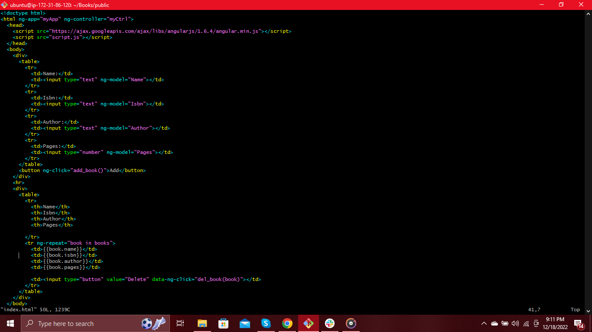

Change directory back to Books
```
cd ..
```
Start the server by running the command
```
node server.js
```
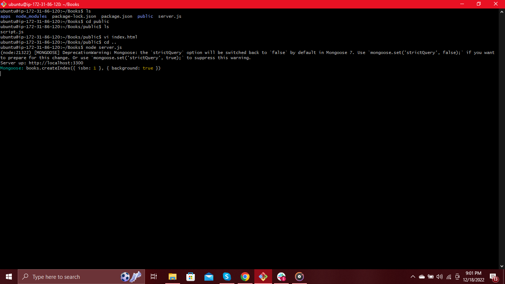

The server is now up and running, we can connect it via port `3300`.

To be able to access it from the internet, we go to edit inbound rules on our instance and open `TCP port 3300` by clicking on add rules in our `EC2` Instance. We then click on save when we are done.


We can now access the Web book register application through our browser using

`http://<IP-address>:3300`

N/B: The IP address can be gotten from the AWS instance.

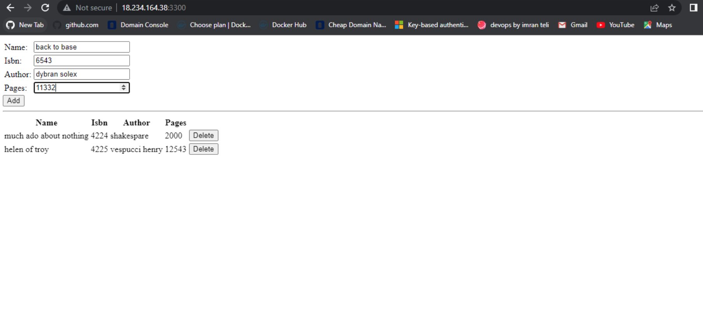

We have successfully created our Web Book Register Application.
