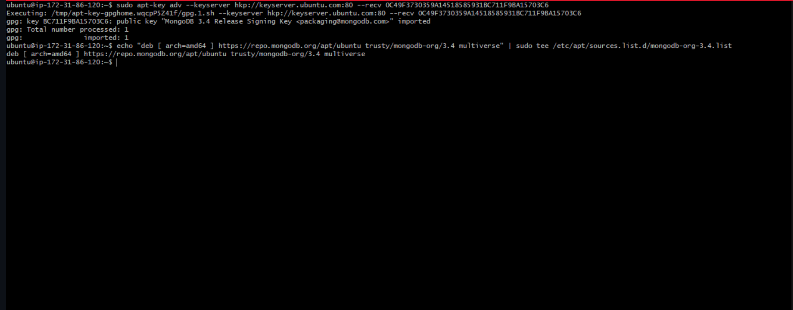

# MEAN STACK IMPLEMENTATION

**MEAN stack** is a combination of the following:

- **MongoDB** (Document database) – Stores and allows to retrieve data.
- **Express** (Back-end application framework) – Makes requests to Database for Reads and Writes.
- **Angular** (Front-end application framework) – Handles Client and server Requests.
- **Node.js** (JavaScript runtime environment) – Accepts requests and displays results to end user.
To complete this project you will need an AWS account and an instance with **Ubuntu Server OS**. We are setting up a **MEAN STACK** using **EC2**.


We need to do the following:

create an account on [AWS](https://aws.amazon.com/).
we create an instance (virtual machine) by selecting “`ubuntu server 20.04 LTS`” from `Amazon Machine Image(AMI)`(free tier).
we select **“t2.micro(free tier eligible)”**.
then go to the security group and select `a security group` review and launch.
How to create an aws free tier account. click [here](https://www.youtube.com/watch?v=xxKuB9kJoYM&list=PLtPuNR8I4TvkwU7Zu0l0G_uwtSUXLckvh&index=8)

This launches us into the instance as shown in the screenshot:


We open our terminal and go to the location of the previously downloaded PEM file.

To know how to download PEM File from AWS. Click [HERE](https://intellipaat.com/community/52119/how-to-download-a-pem-file-from-aws).

We connect to the instance from our terminal


**TASK**

In this task, we are going to implement a simple Book Register web form using MEAN stack.

There are a few steps we need to take to accomplish this task. These steps include:

**INSTALLING NODEJS**

`Node.js` is a JavaScript runtime built on Chrome’s V8 JavaScript engine. Node.js is used in this task to set up the `Express routes` and `AngularJS controllers`.

update ubuntu
```
sudo apt update
```


Next we upgrade ubuntu.
```
sudo apt upgrade
```


we add certificates by running these commands:
```
sudo apt -y install curl dirmngr apt-transport-https lsb-release ca-certificates
```
then
```
curl -sL https://deb.nodesource.com/setup_12.x | sudo -E bash -
```


Then we install node.js
```
sudo apt install -y nodejs
```


Then next step is to install MongoDB.

**INSTALLING MONGODB**

`MongoDB` stores data in flexible, `JSON`-like documents. Fields in a database can vary from document to document and data structure can be changed over time. For our example application, we are adding book records to `MongoDB` that contain book name, isbn number, author, and number of pages.

To start installation process, we run the commands:
```
sudo apt-key adv --keyserver hkp://keyserver.ubuntu.com:80 --recv 0C49F3730359A14518585931BC711F9BA15703C6
```
then
```
echo "deb [ arch=amd64 ] https://repo.mongodb.org/apt/ubuntu trusty/mongodb-org/3.4 multiverse" | sudo tee /etc/apt/sources.list.d/mongodb-org-3.4.list
```




We then go ahead to install `mongoDB` by running the command:
```
sudo apt install -y mongodb
```


Next, we start the MongoDB_ server.
```
sudo systemctl start mongodb
```
To verify that the server is up and running, we run the command:
```
sudo systemctl status momgodb
```


We then install Node package manager (npm).
```
sudo apt install -y npm
```


We then Install body-parser package-We need ‘body-parser’ package to help us process JSON files passed in requests to the server.
```
sudo npm install body-parser
```
We create a folder named "Books" and "cd" into the folder using this command:
```
mkdir Books && cd Books
```

